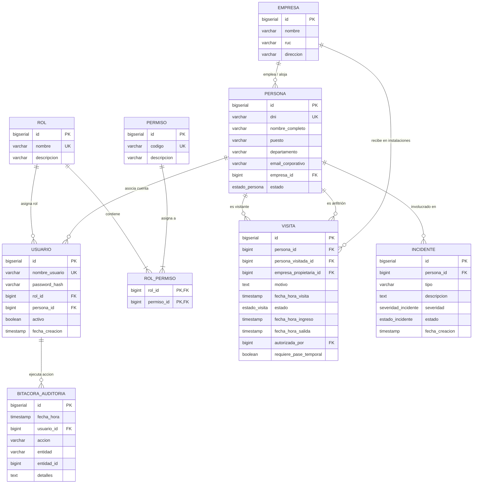

# 🛡️ SICA - Sistema Integrado de Control de Acceso (Zona ACME)

[](https://www.oracle.com/java/)
[](https://openjfx.io/)
[](https://www.postgresql.org/)
[](https://maven.apache.org/)
[](#arquitectura-del-sistema)
[](#pruebas-y-verificación)

---

## 📖 1. Descripción General del Proyecto

El **Sistema Integrado de Control de Acceso (SICA)** es una solución empresarial de escritorio desarrollada en **Java 21** con **JavaFX**, **PostgreSQL** y **Maven**, diseñada específicamente para la gestión de seguridad física, control de personal, contratistas y visitas dentro del complejo industrial y corporativo **Zona ACME**.

### Objetivos Principales:
* **Control Integral de Accesos**: Registro, validación, aprobación y check-in/check-out de ingresos en puntos de control.
* **Seguridad Preventiva Inmediata**: Bloqueo preventivo de personas en lista negra o con incidentes abiertos, propagado instantáneamente a todos los accesos.
* **Trazabilidad y No Repudio**: Bitácora inmutable de auditoría basada en eventos de dominio que registra cada acción, usuario y timestamp.
* **Gestión de Contingencias y Evacuación**: Monitoreo de ocupación en tiempo real con exportación instantánea de listas de evacuación ante emergencias (CSV).
* **Control de Acceso Basado en Roles (RBAC)**: Matriz granular de permisos almacenada en base de datos y autenticación cifrada mediante **BCrypt**.

---

## 🏛️ 2. Arquitectura del Sistema: Hexagonal + Vertical Slice

El sistema implementa una combinación de **Arquitectura Hexagonal (Ports & Adapters)** y **Vertical Slice Architecture**, garantizando que la lógica de negocio permanezca pura, desacoplada de la interfaz gráfica y de los mecanismos de persistencia.

```
src/main/java/com/gestion_de_seguridad/
├── shared/                         # Kernel compartido
│   ├── domain/                     # Eventos base, excepciones de dominio
│   └── infrastructure/             # Pool de conexiones JDBC (Singleton) y config
├── usuarios/                       # Vertical Slice: RBAC y Autenticación
│   ├── domain/                     # Modelos (Usuario, Rol, Permiso), Puertos
│   ├── application/service/        # Autenticación (BCrypt), Verificación de Permisos
│   └── infrastructure/adapter/     # Repositorios JDBC PostgreSQL
├── personas/                       # Vertical Slice: Gestión de Personal y Visitantes
│   ├── domain/                     # Entidad Persona, EstadoPersona, Puertos
│   ├── application/service/        # Validaciones de DNI, Alta, Bloqueo Inmediato
│   └── infrastructure/adapter/     # Repositorio JDBC
├── acceso/                         # Vertical Slice: Control de Visitas y Accesos
│   ├── domain/                     # Máquina de Estados (State) y Estrategias (Strategy)
│   ├── application/service/        # Check-in, Check-out, Regularización de Huérfanos
│   └── infrastructure/adapter/     # Repositorio JDBC Transaccional
├── incidentes/                     # Vertical Slice: Gestión de Brechas de Seguridad
│   ├── domain/                     # Entidad Incidente, Severidad, Estado
│   ├── application/service/        # Reporte y Bloqueo Preventivo Automático
│   └── infrastructure/adapter/     # Repositorio JDBC
├── auditoria/                      # Vertical Slice: Bitácora Inmutable
│   ├── domain/                     # RegistroAuditoria, Puertos
│   ├── application/service/        # Registro de Eventos
│   └── infrastructure/adapter/in/  # AuditoriaEventListener (Observer Bus)
└── ui/                             # Adaptador Primario: Interfaz Gráfica JavaFX
    ├── Launcher.java               # Punto de entrada JavaFX
    ├── VistaLogin.java             # Controlador FXML de Login
    ├── VistaPrincipal.java         # Shell Principal y Navegación
    ├── VistaCheckIn.java           # Centro de Control de Accesos
    ├── VistaPersonas.java          # Gestión de Personal y Bloqueo
    ├── VistaIncidentes.java        # Reporte y Seguimiento de Brechas
    ├── VistaReportes.java          # Dashboard, Evacuación y Métricas
    └── VistaUsuarios.java          # Gestión de Operadores y Matriz RBAC
```

---

## 🧩 3. Patrones de Diseño de Software

| Patrón | Ubicación en el Código | Propósito y Justificación |
| :--- | :--- | :--- |
| **Observer** | `EventPublisher`, `DomainEvent`, `AuditoriaEventListener` | Desacoplamiento total entre slices. Los servicios emiten eventos de dominio y el slice de auditoría los captura de forma transparente sin acoplamiento directo. |
| **State** | `EstadoVisita` (`CREADA`, `APROBADA`, `EN_CURSO`, `FINALIZADA`, `RECHAZADA`, `CERRADA_POR_SISTEMA`) | Modela las transiciones válidas del ciclo de vida de una visita. Garantiza que no se pueda hacer check-in sin aprobación previa o check-out sin check-in. |
| **Strategy** | `EstrategiaCreacionVisita`, `PreRegistradaStrategy`, `NoAnunciadaStrategy`, `CarnetOlvidadoStrategy` | Permite encapsular y extender las políticas de registro y aprobación según el tipo de visitante (visita preagendada vs. no anunciada vs. olvido de carnet). |
| **Builder** | `Persona.builder()`, `Visita.builder()`, `Usuario` | Facilita la construcción de entidades de dominio complejas manteniendo su inmutabilidad y validando invariantes. |
| **Singleton** | `PostgresDataSource`, `Sesion` | Control centralizado del ciclo de vida de conexiones PostgreSQL y del estado del usuario activo en la sesión. |

---

## 🎯 4. Principios SOLID Aplicados

* **S - Single Responsibility Principle (SRP)**: Cada caso de uso (`GestionarVisitaService`, `GestionarPersonaService`, `AuditoriaEventListener`) tiene una única responsabilidad bien delimitada.
* **O - Open/Closed Principle (OCP)**: Nuevos tipos de ingreso pueden añadirse implementando la interfaz `EstrategiaCreacionVisita` sin modificar el servicio de acceso existente.
* **L - Liskov Substitution Principle (LSP)**: Todos los adaptadores de salida (`VisitaJdbcRepository`, `PersonaJdbcRepository`, `UsuarioJdbcRepository`) son completamente intercambiables a través de sus puertos (`VisitaRepositoryPort`, etc.).
* **I - Interface Segregation Principle (ISP)**: Los puertos de entrada están segregados por capacidad (`AutenticarUsuarioUseCase`, `VerificarPermisoUseCase`, `ConsultarUsuarioUseCase`) para que los clientes solo dependan de lo que realmente usan.
* **D - Dependency Inversion Principle (DIP)**: Las capas de dominio y aplicación dependen exclusivamente de interfaces (puertos), mientras que los adaptadores de infraestructura (JDBC, JavaFX) dependen de las capas internas.

---

## 🗄️ 5. Modelo de Base de Datos Relacional (PostgreSQL)



---

## 🚀 6. Guía de Instalación y Ejecución

### Prerrequisitos:
1. **Java JDK 21** o superior instalado y configurado en el `PATH` (`java -version`).
2. **Apache Maven 3.8+** instalado (`mvn -version`).
3. **PostgreSQL 14+** en ejecución en el puerto `5432`.

### Paso 1: Configurar la Base de Datos PostgreSQL
Crea la base de datos `sica_db` e inicializa el esquema y los datos semilla:
```bash
# Crear base de datos
createdb sica_db

# Ejecutar script DDL (tablas, tipos ENUM, índices)
psql -d sica_db -f src/main/resources/db/schema.sql

# Ejecutar script DML (roles, permisos, usuarios con BCrypt, empresas y personas iniciales)
psql -d sica_db -f src/main/resources/db/data.sql
```

> [!NOTE]
> La configuración de conexión se encuentra en `src/main/resources/application.properties`. Por defecto utiliza `localhost:5432/sica_db` con usuario `postgres` y contraseña `postgres` (con fallbacks automáticos en entornos locales). Modifícalo según tu entorno si es necesario.

### Paso 2: Compilación y Pruebas
Ejecuta la suite de pruebas automatizadas:
```bash
mvn clean test
```
*Se ejecutarán las **26 pruebas de integración** validando la arquitectura hexagonal, transiciones de estado, auditoría y reglas de negocio.*

### Paso 3: Ejecutar la Aplicación
Puedes iniciar la interfaz gráfica de usuario en JavaFX con cualquiera de estas opciones:

**Opción A (Plugin JavaFX):**
```bash
mvn javafx:run
```

**Opción B (Exec Plugin):**
```bash
mvn exec:java
```

**Opción C (Desde cualquier IDE):**
Ejecuta directamente la clase principal [`com.gestion_de_seguridad.ui.Launcher`](file:///home/cristixn/.gemini/antigravity/scratch/seguridad-acme/src/main/java/com/gestion_de_seguridad/ui/Launcher.java).

---

## 🔑 7. Tabla de Credenciales de Prueba

| Usuario | Contraseña | Rol Asignado | Módulos y Capacidades Habilitadas |
| :--- | :--- | :--- | :--- |
| **`admin`** | `1234` | **ADMINISTRADOR** | Control total: Gestión de usuarios (RBAC), altas y bloqueo de personal, resolución de incidentes, aprobación y check-in/out, bitácora de auditoría completa, exportación de evacuación (CSV). |
| **`guarda`** | `1234` | **GUARDA** | Operación de guardia: Registro de visitas no anunciadas y olvido de carnet, validación de check-in / check-out en torniquetes, bloqueo preventivo y reporte de incidentes. |
| **`funcionario`**| `1234` | **FUNCIONARIO** | Autogestión: Pre-registro de visitas para sus departamentos, aprobación y rechazo de solicitudes de ingreso. |

---

## 🚦 8. Cobertura de Flujos Operativos Críticos

1. **Visita Pre-registrada**: El funcionario agenda previamente la visita (`CREADA`), la autoriza (`APROBADA`), y el guardia valida su identidad para dar ingreso (`EN_CURSO`) y salida (`FINALIZADA`).
2. **Visitante No Anunciado**: Llega directamente al control. El guardia registra sus datos mediante la estrategia `NoAnunciadaStrategy`, requiriendo aprobación inmediata antes del check-in.
3. **Carnet Olvidado (Pase Temporal)**: El empleado solicita ingreso temporal mediante `CarnetOlvidadoStrategy`. El sistema **regulariza atómicamente visitas previas huérfanas** (`CERRADA_POR_SISTEMA`) y genera el nuevo pase temporal en estado `APROBADA` listo para ingreso.
4. **Bloqueo Preventivo Inmediato**: Ante una brecha de seguridad reportada en el módulo de Incidentes o Personal, el sistema bloquea inmediatamente a la persona (`INACTIVO`). Cualquier intento de ingreso subsiguiente es rechazado en el acto.
5. **Emergencia y Evacuación**: En caso de siniestro, el módulo de Reportes permite exportar en 1 clic el archivo `CSV` con todas las personas que se encuentran dentro de las instalaciones en ese instante.

---

## 📊 9. Pruebas y Verificación

El proyecto incluye pruebas de integración con base de datos real en JUnit 5:
* `AccesoIntegracionTest`: Ciclo completo de visitas, máquina de estados, transiciones inválidas, rechazos, y regularización atómica de pases por olvido de carnet.
* `UsuariosIntegracionTest`: Autenticación BCrypt, control RBAC granular, permisos jerárquicos y alta de operadores.
* `PersonasIntegracionTest`: Invariantes de DNI, unicidad, bloqueo y reactivación inmediata.
* `IncidentesIntegracionTest`: Reporte por severidad y bloqueo preventivo sincronizado.
* `ReportesIntegracionTest`: Agregaciones en memoria mediante Java Stream API y lista de evacuación en tiempo real.
* `AuditoriaIntegracionTest`: Suscripción y registro inmutable en bitácora ante eventos de dominio.

---

## 📄 Licencia

Desarrollado bajo los estándares de arquitectura limpia y código limpio para **Zona ACME**. Todos los derechos reservados.
