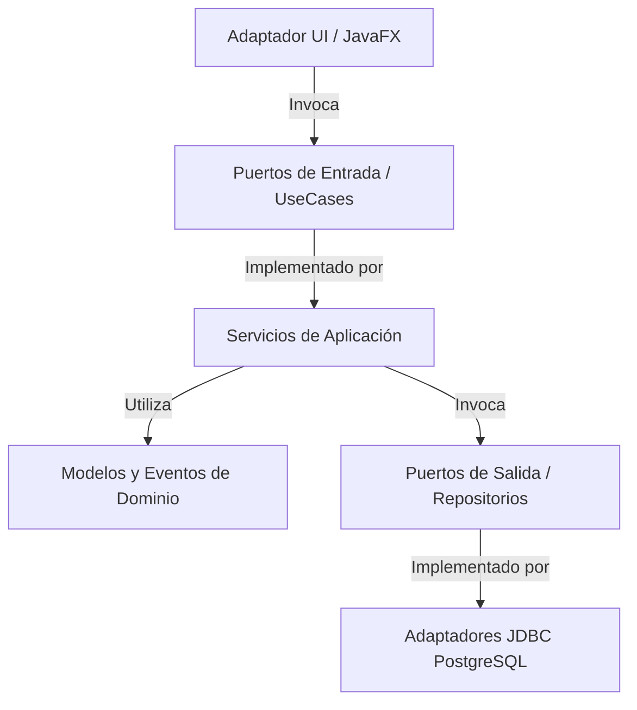
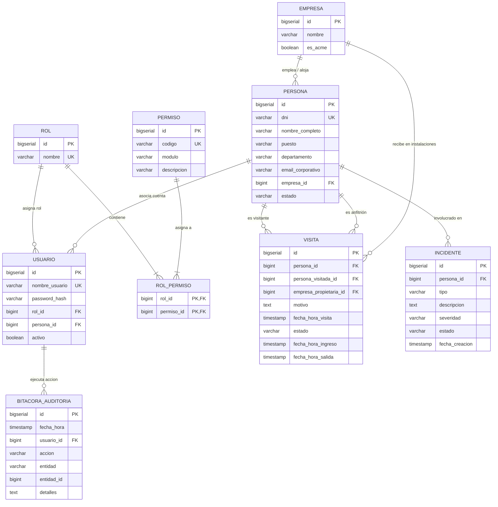

# 🛡️ SICA - Sistema Integrado de Control de Acceso (Zona ACME)

[](https://www.oracle.com/java/)
[](https://openjfx.io/)
[](https://www.postgresql.org/)
[](https://maven.apache.org/)
[](#-6-arquitectura-hexagonal-para-qué-sirve-cada-carpeta)
[](#-10-pruebas-y-verificación)

---

## 📖 1. Descripción General del Proyecto

El **Sistema Integrado de Control de Acceso (SICA)** es una solución empresarial de escritorio desarrollada en **Java 21** con **JavaFX**, **PostgreSQL** y **Maven**, diseñada específicamente para la gestión de seguridad física, control de personal, contratistas y visitas dentro del complejo industrial y corporativo **Zona ACME**.

### Objetivos Principales:
* **Control Integral de Accesos**: Registro, validación, aprobación y check-in/check-out de ingresos en puntos de control y torniquetes.
* **Seguridad Preventiva Inmediata**: Bloqueo preventivo de personas en lista negra o con incidentes abiertos, propagado instantáneamente a todos los accesos.
* **Trazabilidad y No Repudio**: Bitácora inmutable de auditoría basada en eventos de dominio que registra cada acción, usuario y timestamp.
* **Gestión de Contingencias y Evacuación**: Monitoreo de ocupación en tiempo real con exportación instantánea de listas de evacuación ante emergencias (CSV).
* **Control de Acceso Basado en Roles (RBAC)**: Matriz granular de permisos almacenada en base de datos y autenticación cifrada mediante **BCrypt**.
* **Autoservicio de Solicitud de Acceso**: Portal público en login para registro previo de visitantes externos y contratistas.
* **Centro Interactivo de Ayuda y Soporte**: Manual de usuario según rol, directorio de emergencias Zona ACME y emisión de tickets de asistencia.

---

## 💻 2. Guía Rápida para Clonar y Ejecutar (Máquina del Profesor / Nuevo Entorno)

> [!IMPORTANT]
> **No es necesario modificar ninguna línea de código Java** para ejecutar el proyecto en una máquina nueva. Solo asegúrate de tener **PostgreSQL** y **Java 21** instalados.

### 📋 Prerrequisitos:
1. **Java JDK 21** o superior instalado (`java -version`).
2. **Apache Maven 3.8+** instalado (`mvn -version`).
3. **PostgreSQL 14+** corriendo en `localhost:5432`.

---

### 🚀 Paso a Paso de Instalación:

#### 1. Clonar o Descomprimir el Proyecto
```bash
git clone <URL_DEL_REPOSITORIO>
cd seguridad-acme
```
*(O descomprimir el archivo `seguridad-acme.zip`)*.

#### 2. Crear y Poblar la Base de Datos PostgreSQL
Desde DBeaver, pgAdmin o terminal de PostgreSQL:

1. Crear la base de datos:
   ```sql
   CREATE DATABASE sica_db;
   ```
2. Ejecutar los scripts SQL incluidos en el proyecto (en este orden):
   * **1° Estructura:** `src/main/resources/db/schema.sql` (Crea tablas, ENUMs y secuencias).
   * **2° Datos Iniciales:** `src/main/resources/db/data.sql` (Inserta roles, permisos, usuarios `admin`, `guarda`, `funcionario` y datos demo).

> 💡 **En terminal Linux/macOS:**
> ```bash
> psql -U postgres -d sica_db -f src/main/resources/db/schema.sql
> psql -U postgres -d sica_db -f src/main/resources/db/data.sql
> ```

#### 3. Configurar Credenciales *(Solo si la clave de PostgreSQL no es 'postgres')*
El archivo `src/main/resources/application.properties` contiene los parámetros de conexión:
```properties
db.host=localhost
db.port=5432
db.name=sica_db
db.user=postgres
db.password=postgres
```
*Si tu servidor PostgreSQL utiliza otra contraseña (ej. `root` o `1234`), cámbiala en ese archivo o pásala como parámetro:* `mvn javafx:run -Ddb.password=tu_clave`.

#### 4. Ejecutar la Aplicación
```bash
# Opción recomendada:
mvn clean javafx:run

# O usando el plugin exec:
mvn exec:java
```

---

## 🍎 3. Configuración de Java 21 en macOS (Cambiar de JDK 17 a JDK 21)

Si estás trabajando en **macOS** y tu sistema tiene por defecto Java 17, sigue estos pasos para cambiar a Java 21:

### 1. Verificar versiones de Java instaladas en Mac:
```bash
/usr/libexec/java_home -V
```

### 2. Instalar JDK 21 (si no aparece en la lista):
* **Con Homebrew (Terminal):**
  ```bash
  brew install openjdk@21
  ```
  *(O Eclipse Temurin):* `brew install --cask temurin@21`
* **Descarga directa:** Descarga el instalador `.pkg` oficial de [Eclipse Temurin JDK 21 para macOS](https://adoptium.net/temurin/releases/?version=21) (`aarch64` para Apple Silicon M1/M2/M3/M4 o `x64` para Intel).

### 3. Cambiar la versión activa a Java 21 en la Terminal:
* **Para la sesión actual:**
  ```bash
  export JAVA_HOME=$(/usr/libexec/java_home -v 21)
  ```
* **Para dejarlo permanente (por defecto en Mac):**
  ```bash
  echo 'export JAVA_HOME=$(/usr/libexec/java_home -v 21)' >> ~/.zshrc
  source ~/.zshrc
  ```

### 4. Verificar el cambio:
```bash
java -version
mvn -version
```
*(Debe mostrar `openjdk version "21..."` o `java version "21..."`)*.

### 5. Configuración en IntelliJ IDEA (si usas IDE):
1. Ve a **File** $\rightarrow$ **Project Structure...** (`Cmd + ;`).
2. En la pestaña **Project**:
   * **SDK:** Selecciona `21` (si no aparece, selecciona *Add SDK* $\rightarrow$ *Download JDK...* y elige versión 21).
   * **Language Level:** Selecciona `21 - Records, pattern matching...`.
3. En **Preferences / Settings** (`Cmd + ,`):
   * Ve a **Build, Execution, Deployment** $\rightarrow$ **Build Tools** $\rightarrow$ **Maven** $\rightarrow$ **Runner**.
   * En **JRE**, selecciona `Project SDK (21)`.
4. Haz clic en **Apply** y ejecuta el proyecto.

---

## 🗄️ 4. Conexión con DBeaver

| Campo en DBeaver | Valor |
| :--- | :--- |
| **Tipo de Base de Datos** | **PostgreSQL** *(Ícono del elefante)* |
| **Host / Servidor** | `localhost` *(o `127.0.0.1`)* |
| **Port / Puerto** | `5432` |
| **Database / Base de Datos** | `sica_db` |
| **Username / Usuario** | `postgres` |
| **Password / Contraseña** | `postgres` *(o tu clave local)* |
| **JDBC URL** | `jdbc:postgresql://localhost:5432/sica_db` |

---

## 🔑 5. Tabla de Credenciales de Prueba

| Usuario | Contraseña | Rol Asignado | Capacidades Habilitadas en SICA |
| :--- | :--- | :--- | :--- |
| **`admin`** | `1234` | **ADMINISTRADOR** | Control total: Gestión de usuarios (RBAC), altas/bajas de personal, resolución de incidentes, aprobación y check-in/out, auditoría completa y exportación de evacuación. |
| **`guarda`** | `1234` | **GUARDA** | Operación de garita: Check-in / check-out en torniquetes, registro de invitados no anunciados, pases temporales por olvido de carnet, reporte de incidentes y bloqueo preventivo. |
| **`funcionario`**| `1234` | **FUNCIONARIO** | Gestión de área: Pre-registro de visitas programadas, aprobación/rechazo de solicitudes de acceso y **gestión/alta de personal**. |

---

## 🏛️ 6. Arquitectura Hexagonal: ¿Para Qué Sirve Cada Carpeta?

El sistema está estructurado mediante **Arquitectura Hexagonal (Puertos y Adaptadores)** combinada con **Vertical Slice Architecture**. Cada módulo de negocio es un hexágono independiente con la siguiente anatomía:



### Estructura Estándar de las Carpetas en Cada Hexágono:

* `📁 domain/`: **El núcleo puro del negocio**. No depende de frameworks, librerías externas, interfaces gráficas ni bases de datos.
  * `📁 model/`: Contiene las entidades (`Visita`, `Persona`, `Usuario`), enumeradores de estado (`EstadoVisita`, `EstadoPersona`) y objetos de valor con sus invariantes y reglas de validación.
  * `📁 event/`: Clases de eventos inmutables que representan hechos ocurridos en el negocio (`VisitaCreadaEvent`, `CheckInRealizadoEvent`, `PersonaBloqueadaEvent`).
  * `📁 port/in/`: Interfaces que definen los **Casos de Uso** que la aplicación expone a los clientes externos (ej. `GestionarVisitaUseCase`, `AutenticarUsuarioUseCase`).
  * `📁 port/out/`: Interfaces que definen los contratos de persistencia y servicios externos que el dominio necesita (ej. `VisitaRepositoryPort`, `PersonaRepositoryPort`).

* `📁 application/`: **Capa de orquestación y casos de uso**.
  * `📁 service/`: Implementaciones de los casos de uso (`GestionarVisitaService`, `AutenticarUsuarioService`, etc.). Coordina la verificación de permisos, las reglas de negocio, la persistencia y la publicación de eventos en el Event Bus.

* `📁 infrastructure/`: **Detalles técnicos y adaptadores tecnológicos**.
  * `📁 adapter/out/persistence/`: Implementaciones concretas de los puertos de salida que se comunican con PostgreSQL mediante JDBC (`PostgresVisitaRepository`, `PostgresPersonaRepository`, etc.).
  * `📁 listener/`: Observadores de eventos (Patrón Observer) como `AuditoriaEventListener`, que reaccionan a eventos de dominio de forma desacoplada.
  * `📁 config/`: Contenedores de inyección manual de dependencias y Composition Root (`AccesoContainer`, `PersonasContainer`, etc.).

---

### Detalle por Hexágono del Proyecto:

```
src/main/java/com/gestion_de_seguridad/
├── 🛡️ acceso/                         # Hexágono de Visitas, Flujos y Torniquetes
│   ├── domain/model/                  # Visita, EstadoVisita, Estrategias de Creación (Strategy)
│   ├── domain/event/                  # VisitaCreadaEvent, CheckInRealizadoEvent, etc.
│   ├── domain/port/in/                # GestionarVisitaUseCase
│   ├── domain/port/out/               # VisitaRepositoryPort
│   ├── application/service/           # GestionarVisitaService (Transiciones y regularizaciones)
│   ├── infrastructure/adapter/out/    # PostgresVisitaRepository
│   └── infrastructure/config/         # AccesoContainer (Composition Root)
│
├── 👤 personas/                       # Hexágono de Gestión de Personal y Visitantes
│   ├── domain/model/                  # Persona, EstadoPersona (ACTIVO, INACTIVO, LICENCIA)
│   ├── domain/event/                  # PersonaRegistradaEvent, PersonaBloqueadaEvent
│   ├── domain/port/in/ & port/out/    # GestionarPersonaUseCase, PersonaRepositoryPort
│   ├── application/service/           # GestionarPersonaService (Altas, Bajas y Bloqueos)
│   └── infrastructure/                # PostgresPersonaRepository, PersonasContainer
│
├── 🔐 usuarios/                       # Hexágono de Autenticación y RBAC
│   ├── domain/model/                  # Usuario, Rol, Permiso, SesionActiva
│   ├── domain/port/in/ & port/out/    # AutenticarUsuarioUseCase, VerificarPermisoUseCase
│   ├── application/service/           # AutenticarUsuarioService (BCrypt), VerificarPermisoService
│   └── infrastructure/                # PostgresUsuarioRepository, PostgresRolPermisoRepository
│
├── ⚠️ incidentes/                     # Hexágono de Brechas y Novedades de Seguridad
│   ├── domain/model/                  # Incidente, EstadoIncidente, Severidad
│   ├── domain/port/in/ & port/out/    # GestionarIncidenteUseCase, IncidenteRepositoryPort
│   ├── application/service/           # GestionarIncidenteService
│   └── infrastructure/                # PostgresIncidenteRepository, IncidentesContainer
│
├── 📜 auditoria/                      # Hexágono de Bitácora Inmutable (Observer)
│   ├── domain/model/                  # EntradaAuditoria
│   ├── domain/port/in/ & port/out/    # RegistrarAuditoriaUseCase, AuditoriaRepositoryPort
│   ├── application/service/           # RegistrarAuditoriaService, ConsultarAuditoriaService
│   ├── infrastructure/listener/       # AuditoriaEventListener (Escucha el Event Bus)
│   └── infrastructure/adapter/out/    # PostgresAuditoriaRepository, AuditoriaContainer
│
├── 📊 reportes/                       # Hexágono de Métricas y Evacuación de Emergencia
│   ├── domain/model/                  # MetricasDashboard, ItemEvacuacion
│   ├── domain/port/in/ & port/out/    # GenerarReportesUseCase, ExportarEvacuacionCsvUseCase
│   ├── application/service/           # GenerarReportesService, ExportarEvacuacionCsvService
│   └── infrastructure/                # PostgresReportesRepository, ReportesContainer
│
├── 🌐 shared/                         # Módulo Transversal / Kernel Compartido
│   ├── domain/event/                  # DomainEvent, EventPublisher, EventSubscriber
│   ├── domain/Validacion.java         # Validador centralizado (DNI, Nombres, Descriptivos)
│   └── infrastructure/                # DatabaseConfig, PostgresDataSource (Hikari/JDBC)
│
└── 🖥️ ui/                             # Adaptador Primario: Interfaz Gráfica JavaFX
    ├── App.java / Launcher.java       # Arranque y configuración del Stage y ventana
    ├── PanelPrincipal.java            # Shell principal, navegación por rol y barra superior
    ├── VistaLogin.java                # Pantalla de Login y Portal de Solicitud de Acceso
    ├── VistaCheckIn.java              # Control de torniquetes, check-in, check-out y visitas
    ├── VistaPersonas.java             # Módulo de Personal y Personas (Altas y Bloqueos)
    ├── VistaIncidentes.java           # Registro y seguimiento de incidentes de seguridad
    ├── VistaReportes.java             # Dashboard de métricas y botón de evacuación CSV
    ├── VistaUsuarios.java             # Administración de usuarios y matriz de permisos
    ├── VistaAyuda.java                # Centro de ayuda, directorio ACME y tickets de soporte
    └── UiUtils.java                   # Hilos asíncronos (enHiloFondo), avatares y estilos
```

---

## 🧩 7. Patrones de Diseño Implementados

| Patrón | Ubicación en el Código | Propósito y Justificación |
| :--- | :--- | :--- |
| **Observer** | `EventPublisher`, `DomainEvent`, `AuditoriaEventListener` | Desacoplamiento total entre slices. Los servicios emiten eventos de dominio y el módulo de auditoría los persiste automáticamente sin acoplar los servicios. |
| **State** | `EstadoVisita` (`CREADA`, `APROBADA`, `DENTRO`, `FINALIZADA`, `RECHAZADA`, `CERRADA_POR_SISTEMA`) | Modela las transiciones válidas del ciclo de vida de una visita, impidiendo estados inválidos como check-in sin aprobación previa. |
| **Strategy** | `EstrategiaCreacionVisita`, `EstrategiaVisitaPreRegistrada`, `EstrategiaVisitaNoAnunciada`, `EstrategiaVisitaPorOlvidoCarnet` | Encapsula las políticas de registro y aprobación según el tipo de visitante (visita programada vs. no anunciada vs. carnet olvidado). |
| **Builder** | `Persona.builder()`, `Visita.builder()`, `Usuario.builder()` | Construcción limpia e inmutable de entidades complejas con validación previa de invariantes. |
| **Singleton / Composition Root** | `PostgresDataSource`, `Sesion`, `*Container` | Gestión centralizada de conexiones PostgreSQL, sesión activa e inyección de dependencias. |

---

## 🎯 8. Principios SOLID Aplicados

* **S - Single Responsibility Principle (SRP)**: Cada clase tiene una única responsabilidad bien delimitada (servicios de aplicación, repositorios, validaciones).
* **O - Open/Closed Principle (OCP)**: Nuevos tipos de ingreso pueden añadirse implementando la interfaz `EstrategiaCreacionVisita` sin modificar los servicios existentes.
* **L - Liskov Substitution Principle (LSP)**: Todos los adaptadores de salida (`PostgresVisitaRepository`, `PostgresPersonaRepository`) son completamente sustituibles a través de sus interfaces de puerto.
* **I - Interface Segregation Principle (ISP)**: Puertos específicos y reducidos para cada necesidad (`AutenticarUsuarioUseCase`, `VerificarPermisoUseCase`, `GestionarPersonaUseCase`).
* **D - Dependency Inversion Principle (DIP)**: El dominio y la aplicación dependen exclusivamente de abstracciones (interfaces), nunca de implementaciones concretas de base de datos o UI.

---

## 🗄️ 9. Modelo de Base de Datos Relacional



---

## 📊 10. Pruebas y Verificación

El proyecto incluye **26 pruebas de integración automatizadas** en JUnit 5:

```bash
mvn clean test
```

* `AccesoIntegracionTest`: Ciclo completo de visitas, máquina de estados, transiciones inválidas, rechazos, y regularización atómica de pases por olvido de carnet.
* `UsuariosIntegracionTest`: Autenticación BCrypt, control RBAC granular, permisos jerárquicos y alta de operadores.
* `PersonasIntegracionTest`: Invariantes de DNI, unicidad, bloqueo y reactivación inmediata.
* `IncidentesIntegracionTest`: Reporte por severidad y bloqueo preventivo sincronizado.
* `ReportesIntegracionTest`: Agregaciones analíticas y lista de evacuación en tiempo real.
* `AuditoriaIntegracionTest`: Suscripción y registro inmutable en bitácora ante eventos de dominio.

---

## 📄 Licencia

Desarrollado bajo los estándares de arquitectura limpia y código limpio para **Zona ACME**. Todos los derechos reservados.
